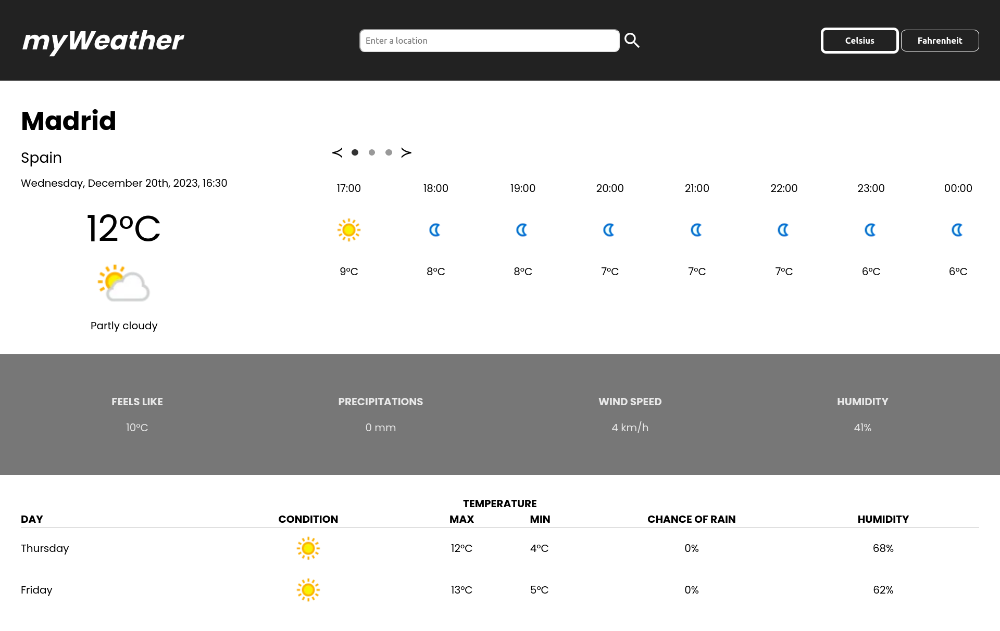

    
    <h1>myLibrary </h1>
    
Weather Webpage

    

        <a href="https://jotafer19.github.io/weather-app/" target="_blank" rel="noreferrer noopener">View Demo</a> · 
        <a href="https://github.com/jotafer19/tic-tac-toe/issues" target="_blank" rel="noreferrer noopener">Report Bug</a> ·
        <a href="https://github.com/jotafer19/tic-tac-toe/issues" target="_blank" rel="noreferrer noopener"> Request Feature</a>
    

## Preview

### Features

- A webpage built to check the weather in the location you want.
- You can see hourly information, additional information and the forecast for the next two days.
- Clean and responsive UI for better visuals, with indicators for possible errors.

### Built With

- 
- 
- 

### Tools Used

- 
- 
- 

## Usage

- Press the '+' button to add a new book. It opens a new dialog where you must enter the information required and if you have read it.
- You can change the temperature units between Celsius and Fahrenheit.
- Change the active temperature units pressing its buttons.

## Outcome

- Used HTML **forms** to take information from the user.
- Used CSS **grid** and **flex** to manage layout.
- Used **JavaScript** to apply functionality.
- Used **Git** and **GitHub** for project management.
- Tried to maintain **clean code**.

## What I learned

- Better knowledge and it's practical usability of **Promises** and the **use of async and await keywords**.
- A lot of minor things.

## Acknowledgments

- Inspiration by [**The Odin Project**](https://www.theodinproject.com/lessons/node-path-javascript-weather-app).
